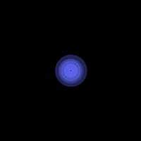
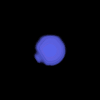
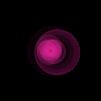

#Starburst

A collection of animated PNG sequences for use as loading indicators in your Apple Watch app.

###Types

**Disperse:**

Recommended duration: 6s
 
 

**Bang:**

Recommended duration: 5s
 
 

**Ripple:**

Recommended duration: 6s
 
 

**Wave:**

Recommended duration: 8s
 
 

**Nebula:**

Recommended duration: 10s
 
 

##Instructions
To create image based animations for your Apple Watch app, first drag your desired image sequence folder into your WatchKit App's Images.xcassets. Then create a `WKInterface` image object in your storyboard and set the image name to the image sequence name without any numbers.

For example, if you want to use the disperse animation, set your image file to: "disperse_.".

Then set its respective duration, as recommended above.

